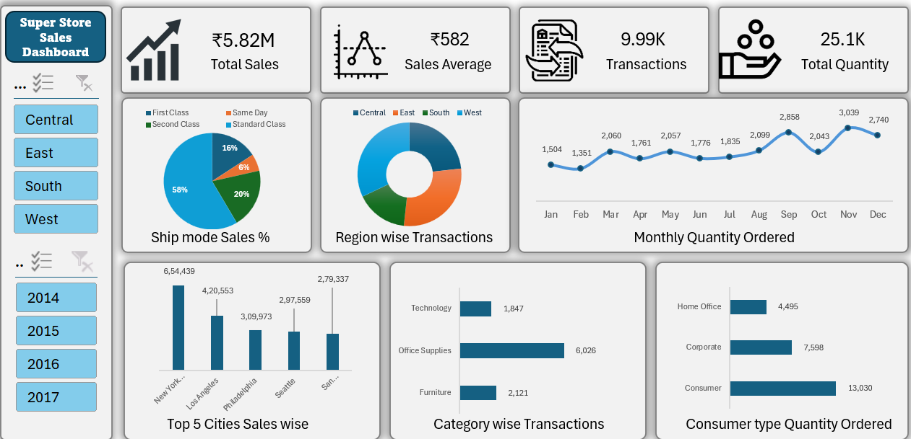

# 📊 Superstore Sales Dashboard (Excel)

## 🔍 Overview

This project showcases an interactive Excel dashboard built using the Superstore dataset to analyze sales performance, customer behavior, and regional trends.

---

## 🎯 Objectives

* Analyze overall sales and transaction trends
* Analyze customer segment contribution
* Identify top-performing regions, categories, and cities
* Track monthly demand patterns

---

## 📌 Key Metrics

* Total Sales: ₹5.82M
* Sales Average: ₹582
* Total Transactions: 9.99K
* Total Quantity: 25.1K

---

## 📈 Dashboard Features

* Interactive filters (Region & Year)
* KPI cards for quick insights
* Monthly demand trend
* Category & segment analysis
* Top-performing cities

---

## 💡 Business Insights

* Sales peak in November–December, indicating strong seasonal demand
* Consumer segment contributes the highest number of orders
* Office Supplies category drives the most transactions
* West region shows highest transaction volume

---

## 🛠 Tools Used

* Microsoft Excel
* Pivot Tables
* Data Visualization

---

## 📸 Dashboard Preview

 

Below is a snapshot of the interactive dashboard.

 

---

## 🚀 How to Use

1. Download the Excel file from this repository.
2. Open it using Microsoft Excel
3. Use slicers(Region and Year) to explore data and interact with the dashboard.

